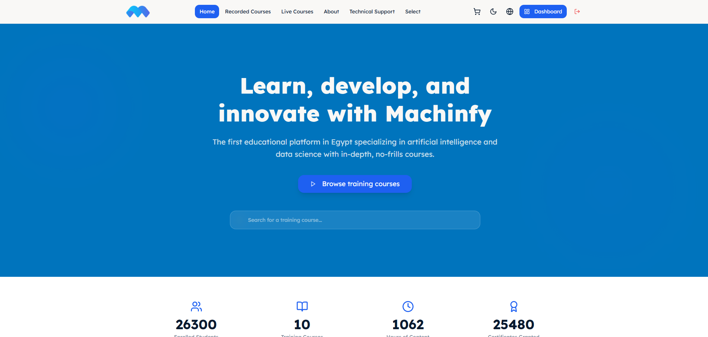
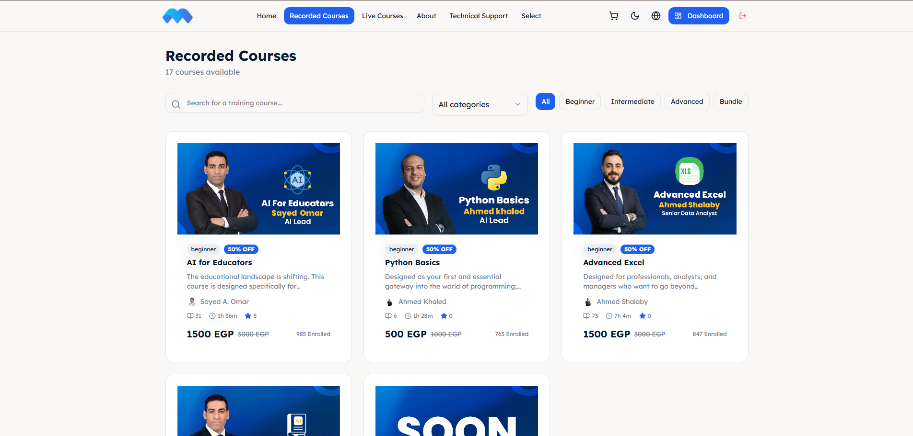
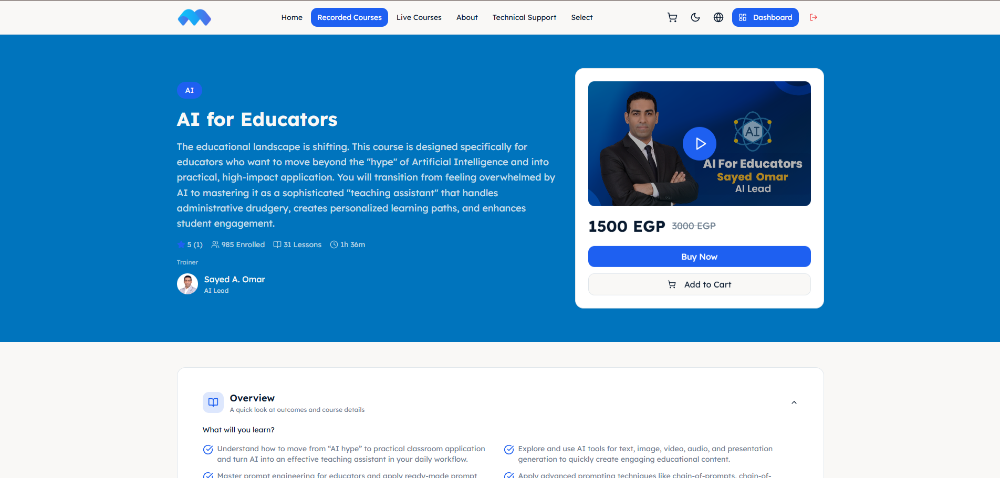
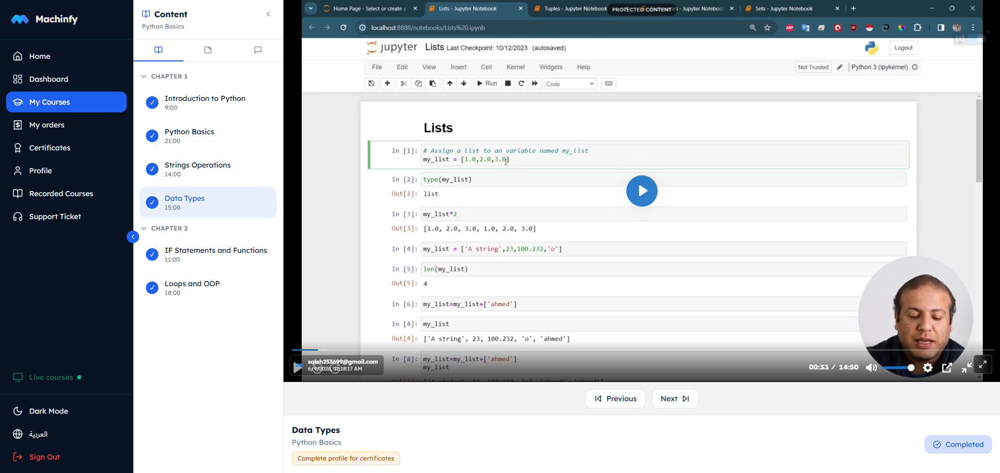
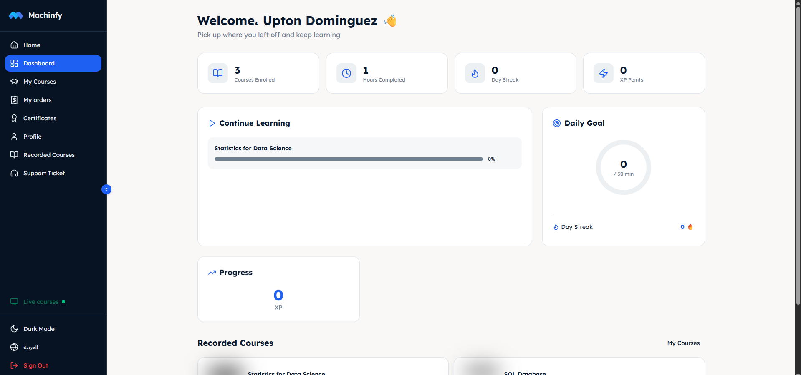
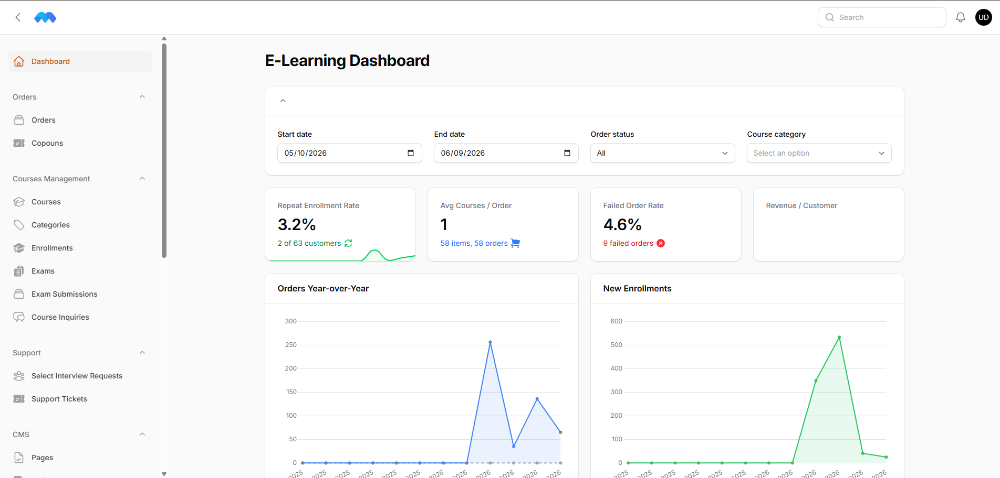
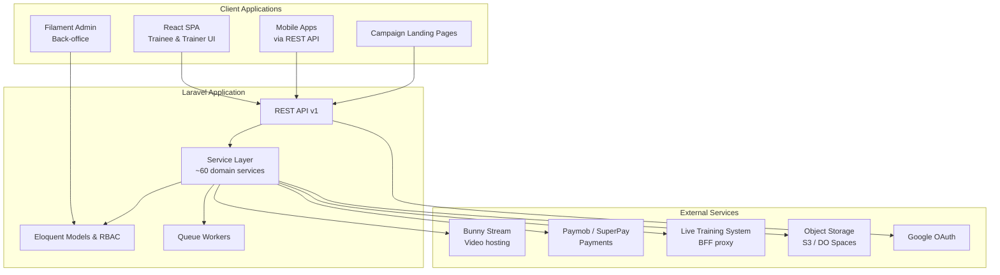

# Machinfy — Bilingual E-Learning Platform

> **Portfolio overview** — This document describes a private, production e-learning platform.

**Role:** Full-stack developer  
**Status:** Production — [machinfy.com](https://machinfy.com/)  
**Languages:** Arabic (RTL) + English

---

## Live Site

**[https://machinfy.com/](https://machinfy.com/)**

---

## Overview

**Machinfy** is a full-featured e-learning platform for professional courses in AI and technology. It serves trainees, trainers, and administrators through a modern web experience and a mobile-ready REST API.

The platform supports **self-paced video courses**, **live interactive cohorts**, and **blended programs**, with end-to-end commerce, assessments, certificates, and operational tooling for a regional (MENA) market.

---

## Screenshots

### Home page

### Course catalog

### Course detail

### Course player

### Trainee dashboard

### Admin panel

---

## What I Built

### Learner experience (React SPA)

- Bilingual public site with locale-prefixed routing (`/en`, `/ar`) and RTL support
- Course catalog with categories, search, reviews, FAQs, and course inquiries
- Rich **course player**: video lessons, quizzes, text content, progress tracking, notes, and per-lesson Q&A
- **Exams** with MCQ and essay submissions, grading workflow, and results
- **Certificates** with eligibility rules, PDF generation, and public verification
- Trainee dashboard: enrollments, orders, profile, support tickets
- **Live courses portal**: groups, sessions, reservations, and classroom access
- Marketing modules: blog, CMS pages, custom landing pages with checkout, wheel-of-fortune promotions
- **Prompts hub**: configurable AI prompt template catalog with dynamic forms
- **Select catalog**: talent/service listings with interview request flows

### Trainer portal

- Dedicated trainer dashboard and course management views
- Trainee lists, Q&A replies, and bilingual trainer profiles
- Portal switcher for users with both trainee and trainer roles

### Commerce & payments

- Shopping cart, coupons, and multi-step checkout
- Payment gateway abstraction supporting **Paymob** and **SuperPay** (regional gateways)
- Manual payment methods with proof upload and admin review
- Order management, refunds, and revenue analytics in admin

### Admin back-office (Filament)

- ~30 Filament resources for courses, content, users, commerce, and support
- Visual **course builder** for chapters, lessons, and assessments
- Role-based access control with Spatie Permission
- Dashboard with stats and charts
- Import/export for lessons, exams, articles, and trainees
- Guarded SQL workbench for read-only admin analytics

### API & mobile readiness

- Versioned REST API (`/api/v1`) with Sanctum token authentication
- Consistent API response envelope for success, pagination, and errors
- Auto-generated API documentation (Scribe)
- Internal mobile developer guide for React Native / Flutter integration
- Meta product catalog feed for marketing integrations

---

## Architecture

### Design decisions

| Area             | Approach                                                                      |
| ---------------- | ----------------------------------------------------------------------------- |
| **Backend**      | Laravel 12 monolith with a dedicated service layer for business logic         |
| **Frontend**     | React 19 + TypeScript SPA (React Router, TanStack Query, Zod)                 |
| **Admin**        | Filament v5 server-driven UI on Livewire                                      |
| **API**          | JSON resources with a unified response envelope; Form Request validation      |
| **Auth**         | Sanctum (API), Fortify (web), Google OAuth, email OTP, optional 2FA           |
| **i18n**         | Bilingual models (`_ar` / `_en` fields), `Accept-Language` middleware         |
| **Payments**     | Strategy pattern — swappable gateway implementations                          |
| **Live courses** | Server-side BFF proxy; user tokens stored encrypted, never exposed to browser |
| **Media**        | Bunny Stream for video; object storage for uploads                            |

---

## Tech Stack

### Backend

| Technology        | Purpose                        |
| ----------------- | ------------------------------ |
| PHP 8.3+          | Runtime                        |
| Laravel 12        | Application framework          |
| Filament 5        | Admin panel                    |
| Laravel Sanctum   | API authentication             |
| Laravel Fortify   | Web auth (2FA, password reset) |
| Spatie Permission | Roles & permissions            |
| Spatie Backup     | Database backups               |
| Scribe            | API documentation              |
| DomPDF            | Certificate PDF generation     |

### Frontend

| Technology            | Purpose               |
| --------------------- | --------------------- |
| React 19              | UI framework          |
| TypeScript            | Type safety           |
| Vite 7                | Build tooling         |
| Tailwind CSS v4       | Styling               |
| Radix UI              | Accessible components |
| TanStack React Query  | Server state          |
| React Hook Form + Zod | Forms & validation    |
| Framer Motion         | Animations            |

### Integrations

| Service                      | Use case                                                |
| ---------------------------- | ------------------------------------------------------- |
| Bunny Stream                 | Video lessons and duration sync                         |
| Paymob / SuperPay            | Online payments (cards, installments, regional methods) |
| Google OAuth                 | Social login                                            |
| AWS S3 / DigitalOcean Spaces | File and media storage                                  |
| Google Tag Manager           | Analytics (admin excluded)                              |

### Quality & DevOps

| Practice    | Detail                                                      |
| ----------- | ----------------------------------------------------------- |
| **Testing** | 90+ Pest feature/unit tests (API, Filament, services, auth) |
| **CI**      | GitHub Actions — PHP 8.4/8.5 matrix, frontend build, Pest   |
| **Linting** | Laravel Pint, ESLint, Prettier, TypeScript strict checks    |
| **Queues**  | Database-backed queue for async jobs                        |

---

## Feature Highlights

### Course delivery modes

| Mode            | Description                                           |
| --------------- | ----------------------------------------------------- |
| **Recorded**    | Self-paced video courses with Bunny Stream player     |
| **Interactive** | Live cohorts via external training system integration |
| **Blended**     | Hybrid recorded + live components                     |

### Assessment & credentials

- Configurable exams per course with submission tracking
- Certificate eligibility engine and downloadable PDFs
- Public certificate verification endpoint

### Growth & operations

- Coupon codes and promotional wheel events
- Custom landing pages with embedded checkout for campaigns
- Course inquiry and lead sync to external CRM
- Support ticket system and help center
- Admin revenue widgets and order refund workflows

---

## Scope & Scale (indicative)

| Metric                   | Approximate scale                                                                                  |
| ------------------------ | -------------------------------------------------------------------------------------------------- |
| API test suites          | 90+ test files                                                                                     |
| Filament admin resources | ~30 resources                                                                                      |
| Domain services          | ~60 service classes                                                                                |
| SPA screens              | 40+ pages (catalog, player, live, trainer, auth, etc.)                                             |
| API domains              | Auth, catalog, player, exams, certificates, cart, payments, trainer, live portal, prompts, support |

---

## Contact

If you would like to discuss this project, architecture decisions, or similar work:

- **LinkedIn:** [Saleh Goied](https://www.linkedin.com/in/saleh-goied)
- **Email:** [salehgoied@gmail.com](mailto:salehgoied@gmail.com)

---

*Built as a production e-learning platform.*
